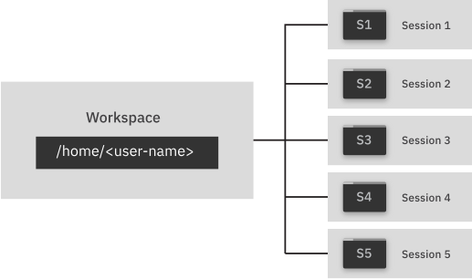

---

copyright:
  years: 2020
lastupdated: "2020-01-21"

keywords: IBM Cloud Shell, cloud shell, terminal, shell session, usage limit, usage quota, restart, workspace, home directory

subcollection: cloud-shell

---

{:new_window: target="_blank"}
{:shortdesc: .shortdesc}
{:table: .aria-labeledby="caption"}
{:codeblock: .codeblock}
{:tip: .tip}
{:important: .important}
{:note: .note}

# Working in {{site.data.keyword.cloud-shell_short}}
{: #shell-ui}

{{site.data.keyword.cloud-shell_full}} contains a personal workspace and sessions where you can run commands. You can open up to five concurrent sessions, which operate independently so you can work with different resources, regions, and accounts at once.
{: shortdesc}

To open {{site.data.keyword.cloud-shell_notm}}, click the {{site.data.keyword.cloud-shell_notm}} icon  in the console menu bar. A session starts and automatically logs you in with your current account through the {{site.data.keyword.cloud_notm}} CLI.

## {{site.data.keyword.cloud-shell_short}} sessions
{: #shell-env}

A {{site.data.keyword.cloud-shell_short}} session is the terminal interface where you can run commands, scripts, and other tools. It's similar to the command prompt on your local machine, but it's preconfigured with the full {{site.data.keyword.cloud_notm}} CLI and numerous [plug-ins and tools](/docs/cloud-shell?topic=cloud-shell-plugins-tools) so that you can work in {{site.data.keyword.cloud_notm}} without having to install anything.

When you open a session, you start in your {{site.data.keyword.cloud-shell_short}} workspace's home directory, `/home/<user-name>`. Your home directory provides a temporary place for you to work with files in {{site.data.keyword.cloud-shell_short}}, and it's shared between all of your sessions. Because data in your home directory isn't persisted, any files that you add or change are removed when {{site.data.keyword.cloud-shell_short}} is closed.

Each session automatically closes if it's not used for 30 minutes. If you don't use {{site.data.keyword.cloud-shell_short}} for an hour - that is, another 30 minutes after the last session is closed - all files and data in your {{site.data.keyword.cloud-shell_short}} workspace are erased. If you need to step away from {{site.data.keyword.cloud-shell_short}}, be sure to download any files that you want to keep. For more information, see [Working with files](/docs/cloud-shell?topic=cloud-shell-files).
{: tip}

{: caption="Figure 1. Your personal workspace and sessions in Cloud Shell" caption-side="bottom"}

## Using multiple sessions
{: #multi-shell}

To open a new session, click the Open icon . Each session maintains separate command histories, which are removed when you close the session. Because the workspace storage is shared between sessions, you can save a file to your home directory in one session, and then open the file in another session.

When you open a session, you're logged in with the {{site.data.keyword.cloud_notm}} CLI targeting the account and region that you were in when you opened {{site.data.keyword.cloud-shell_notm}}. This account and region are the default for every session, even if you changed them through the command line in another session. For example, say you run `ibmcloud login` to switch to a different account in a session. When you open a new session, it's logged in to the original account and not the one that you switched to previously.

To switch the default account for your sessions, close your {{site.data.keyword.cloud-shell_short}} environment, switch the account in the {{site.data.keyword.cloud_notm}} console menu bar, and then reopen {{site.data.keyword.cloud-shell_short}}.
{: tip}

## Restarting {{site.data.keyword.cloud-shell_notm}}
{: #shell-restart}

When you restart {{site.data.keyword.cloud-shell_short}}, any open sessions are closed and all of your files and data is removed. Before you restart, be sure that you download any files that you want to keep to your local system.

To restart, click the Menu icon , and select **Restart**.

## Tracking your usage
{: #usage-limit}

{{site.data.keyword.cloud-shell_notm}} has a usage quota that limits you to 4 hours of continuous use or up to 30 hours within a week. The time that you have active sessions open counts toward these limits.

If you reach these limits, your {{site.data.keyword.cloud-shell_notm}} sessions are closed. Closing {{site.data.keyword.cloud-shell_notm}} removes any data in your workspace, including your files and command history.

When you reach your usage limit, you get a notification that {{site.data.keyword.cloud-shell_notm}} will close in 5 minutes. Use this time to complete any urgent tasks.
{: tip}

At any point, you can track your usage and check when your weekly limit resets. In the {{site.data.keyword.cloud-shell_notm}} menu bar, click the Menu icon , and select **Usage quota**. You can view how many hours you used {{site.data.keyword.cloud-shell_notm}} during the current weekly period and the date and time when it will reset.

The time that you used of the 30-hour usage limit resets back to 0 at the same time each week. After you reach the 30-hour usage limit, you can still use {{site.data.keyword.cloud-shell_notm}} for up to 5 minutes at a time to complete quick tasks, such as to run a few simple commands.

{{site.data.keyword.cloud-shell_notm}} is intended for {{site.data.keyword.cloud_notm}} administration and development purposes. It isn't intended to support long-running or compute-intensive scripts or programs or to process confidential data. Any usage outside of these guidelines might result in your access to {{site.data.keyword.cloud-shell_notm}} or {{site.data.keyword.cloud_notm}} being suspended. For more information, see the [{{site.data.keyword.cloud_notm}} Terms and Notices](/docs/overview/terms-of-use?topic=overview-terms).
{: note}
